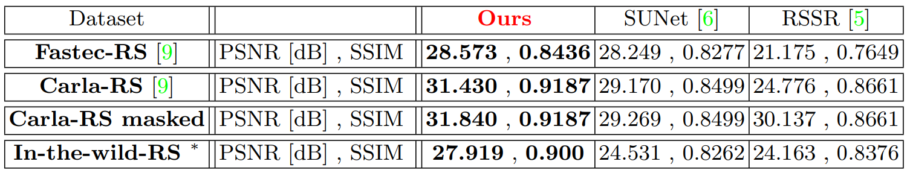

# [Video Rolling Shutter](https://www.wisdom.weizmann.ac.il/~vision/VideoRS/)
### Please see the full [Project page](https://www.wisdom.weizmann.ac.il/~vision/VideoRS/) | [Paper (PDF)](https://www.wisdom.weizmann.ac.il/~vision/VideoRS/supplementary/refs/Home/RollingShutter_ECCV2022.pdf)
**This is the official paper implementation of our ECCV 2022 paper**,
Combining Internal and External Constraints for Unrolling Shutter in Videos


## Getting Started


### Clone
Clone the Repo:  
```bash
git clone https://github.com/eyalnaor/VideoRollingShutter.git
cd VideoRollingShutter
```

### Environment
Running our code requires setting up 2 environments:
1. **VideoRS_env** - Our main environment. <br />
    In order to create VideoRS_env, please run the following commands:
    ```bash
    conda env create -f VideoRS_env.yml
    ```
2. **DAIN_env** - An environment capable of running DAIN. <br />
    In order to create DAIN_env, please follow the instructions [here](https://github.com/baowenbo/DAIN).  <br />


### Dataset
The fast and preferred method of downloading the dataset is from our website using the following commands:
```bash
wget https://www.wisdom.weizmann.ac.il/~vision/VideoRS/supplementary/refs/In-the-wild-RS_Dataset/In-the-wild-RS.zip
unzip In-the-wild-RS.zip
rm -f In-the-wild-RS.zip
```
A slow alternative is to create the dataset from scratch using the following script:
```bash
python InTheWildRS_DatasetDownload.py
```
For this, you will need DAIN_env to also have the ffmpeg package (We ran with ffmpeg=5.0.1). <br />
In addition, you need to place the path for the DAIN_env python path (for e.g.: path/.conda/envs/DAIN_env/bin/python) in the script, under DAIN_env_python_path.

The script is configurable and enables downloading a subset/different videos, as well as creating different RS difficulty levels (see paper).

**NOTE** - We shot the "Spinners" video using our own camera, therefore it is not downloadable from youtube and is accessable only through our website.  

The dataset would be placed under ./In-the-wild-RS folder. 


## Running the Code


### Code
The code is composed of two separate scripts. This is so in order to both emphasize the plug-and-play nature of the temporal-interpolation module in our
pipeline, and to allow for different python environments for the external temporal-interpolation code and our code for easier setup.
The two scripts that need to be run sequentially are:
1. **part1_PlugAndPlay_TemporalInterpolation.py**  -  This part is the plug-and-play external temporal interpolation (TI) algorithm, detailed in section 4.1 in the paper.
Here we use (as in the paper) - DAIN [citation below]. This script is to be run with DAIN_env.
2. **part2_MergeNet_and_xtOptimization.py**  -  This part is our written algorithm GS "sampling", MergeNet and the xt-optimization (detailed in section 4 in the paper). This code is to be run with VideoRS_env. 

**In order to run the entire code**:
```bash
conda activate DAIN_env
python part1_PlugAndPlay_TemporalInterpolation.py
conda deactivate
conda activate VideoRS_env
python part2_MergeNet_and_xtOptimization.py
```
This will run the code with default configuration, as used to produce the results in the paper.  

### Config
There are many tunable parameters. config.json sets the default values we used in our experiments.  

Below are the main configuration parameters to change:
 
* **working_dir** - output location. Saves "frozen" code version and results of the VideoRS algorithm.  
* **input_RS_folder** - input folder for multiple directories of RS frames. For instance:   input_RS_folder/vid1/{001.png, 002.png,...},   input_RS_folder/vid2/{001.png, 002.png,...}
* **input_in_name** - string that is in the RS frames' names. Enables using datasets that have RS and GS together in the same folder.
* **cleanup_during_run** - if 'true' - will delete intermediary results, and save only the final ones. Recommended for memory reasons.  
* **MergeNet_config/loading_model/checkpoint** - path to trained MergeNet model. If provided - evals MergeNet using this ckpt instead of retraining MergeNet. Default network provided - The network trained on Carla-RS, as detailed in paper.


## Results


### Visual Results
Below are sample comparisons of our results vs. the SotA competitors.<br />
RS input, GS-reconstructions and residual misliagnments are shown. Please press play. <br />


For all the videos and results please see [project page](https://www.wisdom.weizmann.ac.il/~vision/VideoRS/supplementary/Visual_Results.html).

### Numerical Results



## BibTex
Please cite the following papers:
```
@inproceedings{naor2022videors,
  title={Combining Internal and External Constraints for Unrolling Shutter in Videos},
  author={Naor, Eyal and Antebi, Itai and Bagon, Shai and Irani, Michal},
  booktitle={European Conference on Computer Vision (ECCV)},
  year={2022}
}
@inproceedings{bao2019dain,
  title={Depth-aware video frame interpolation},
  author={Bao, Wenbo and Lai, Wei-Sheng and Ma, Chao and Zhang, Xiaoyun and Gao, Zhiyong and Yang, Ming-Hsuan},
  booktitle={Proceedings of the IEEE/CVF Conference on Computer Vision and Pattern Recognition (CVPR)},
  year={2019}
}
```
